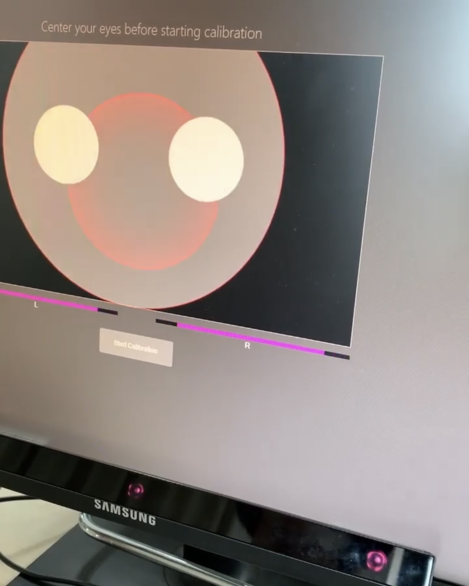

# EyeTracking Interface (KCI 등재논문)

마우스 기기의 사용 없이 **시선추적**과 **[음성인식](https://github.com/confettimimy/EyeTracking-Interface/tree/main/EYE(sound))**(외 **[눈 깜빡임](https://github.com/confettimimy/EyeTracking-Interface/tree/main/EYE(blink))**, **[1초 응시 방식](https://github.com/confettimimy/EyeTracking-Interface/tree/main/EYE(gaze))**)을 이용해 컴퓨터를 사용할 수 있는 인터페이스

## [시연영상 보러가기](https://blog.naver.com/confettimimy/222095713733)  👈🏻😃 

### < Demo >


포인터의 이동은 **눈의 시선**으로, 

포인터의 실행은 **음성명령**(외 눈 깜빡임, 1초 응시 방식)으로 진행합니다.

👁👁👄 → 💻

---

## 아이트래킹 인터페이스 구동하기

**직접 개발한 소프트웨어는 [eyemove.py](https://github.com/confettimimy/EyeTracking-Interface/blob/main/EYE(sound)/eyemove_0813(%EC%B5%9C%EC%8B%A0%ED%8C%90)2.py) 입니다.**

​    

### 1. tobii_research 라이브러리 가져오기

```python
import tobii_research
```

### 2. 아이트래커 연결 및 확인

tobii_research.find_all_eyetrackers() 함수를 사용해 사용 가능한 시선 추적기 목록을 가져옵니다.

```python
found_eyetrackers = tr.find_all_eyetrackers()

eyetracker = found_eyetrackers[0]

print("Address: " + eyetracker.address)
print("Model: " + eyetracker.model)
print("Name (It's OK if this is empty): " + eyetracker.device_name)
print("Serial number: " + eyetracker.serial_number)
```

*find_all_eyetrackers에서 반환 된 객체는 tobii_research.EyeTracker의 인스턴스이다.

### 3. Calibration 수행

시선 데이터를 보다 더 정확하게 수집하기 위해 캘리브레이션을 수행

PC 앞 사용자의 얼굴, 눈에 맞춰 조정합니다.



### 4. 시선 데이터를 실시간으로 가져오기

```python
def gaze_data_callback(gaze_data):
    . . .
```

콜백 함수를 이용해 일정한 간격으로 데이터 샘플을 출력한다.

```python
eyetracker.subscribe_to(tr.EYETRACKER_GAZE_DATA, gaze_data_callback, as_dictionary=True)
```

EyeTracker 개체의 subscribe_to 함수를 호출한다.

​    

---

## 시스템 설계도


시스템은 크게 **시선추적**과 **음성인식** 모듈 파트로 구성된다.

인터페이스 사용시 사용자는 시선을 계속 이동시켜 포인터를 제어한다.

클릭을 원할 시 그때마다 음성명령을 내려 원하는 동작을 수행시킨다. 음성명령어로는 음성 인식률이 97%인 "OK", "NO" 두 가지를 사용한다.

